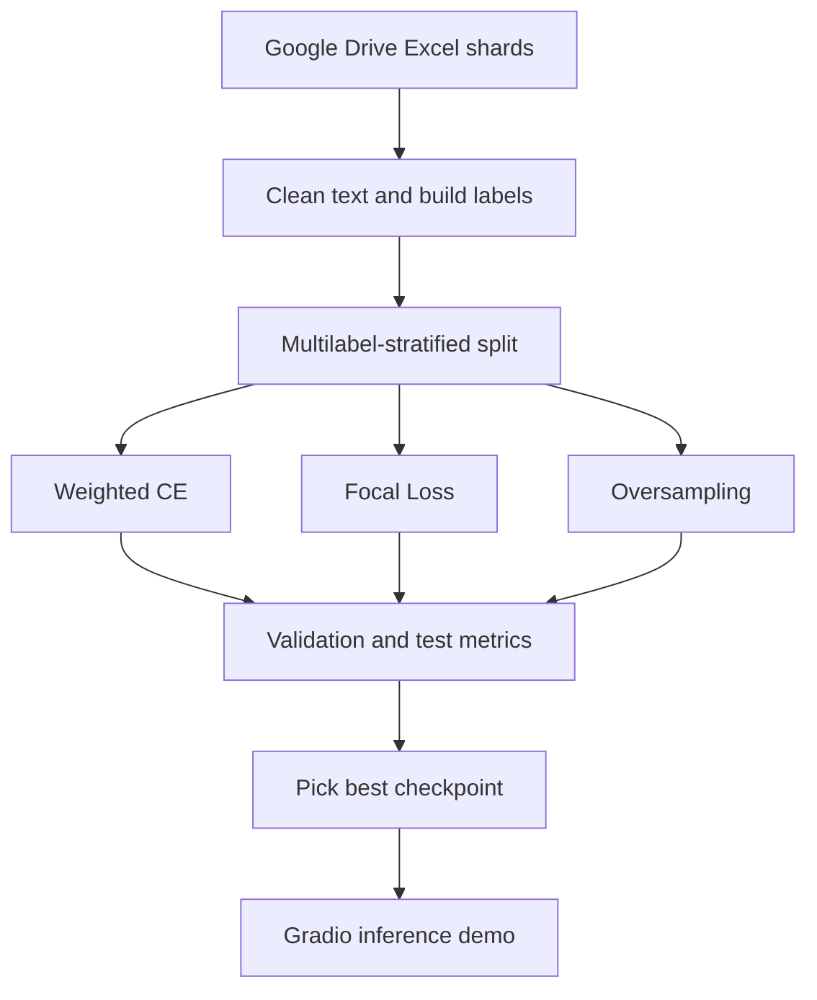

# GoEmotions Fine Tuned RoBERTa Architecture with 3 Experimental Setups

> Colab-first notebook for fine-tuning RoBERTa on GoEmotions and comparing three imbalance-handling strategies.

Built on GoEmotions, a 58k-example Reddit emotion corpus with 27 labels plus Neutral, this notebook turns the dataset into a reproducible multi-label training pipeline with three imbalance strategies and a Gradio demo.

Notebook: [GoEmotions_Fine_Tuned_RoBERTa_Architecture_with_3_Experimental_Setups.ipynb](GoEmotions_Fine_Tuned_RoBERTa_Architecture_with_3_Experimental_Setups.ipynb)

## At a Glance

| Item | Details |
| --- | --- |
| Task | Multi-label emotion classification |
| Base model | `SamLowe/roberta-base-go_emotions` |
| Training environment | Google Colab + Google Drive |
| Input files | `goemotions_1.xlsx`, `goemotions_2.xlsx`, `goemotions_3.xlsx` |
| Main strategies | weighted CE, focal loss, oversampling |
| Focus labels | grief, remorse, fear, nervousness |
| Outputs | three checkpoints, comparison metrics, Gradio demo |

## Visual Workflow

## Why This Notebook Exists

Class imbalance is the central problem in this project. Rare emotions such as grief, remorse, fear, and nervousness are much harder to learn than high-frequency labels, so the notebook compares three different ways to shift the training signal without changing the dataset itself.

The design keeps everything else constant: the same cleaned inputs, the same multilabel split, the same RoBERTa base checkpoint, and the same evaluation metrics. That makes the comparison easier to trust.

## What the notebook does

The notebook:

* mounts Google Drive and loads the three dataset shards
* cleans and normalizes text
* converts emotion labels into multi-hot vectors
* builds a multilabel-stratified train/validation/test split
* fine-tunes `SamLowe/roberta-base-go_emotions`
* evaluates each experiment with micro, macro, weighted, and focus-label metrics
* launches a Gradio demo for interactive prediction

## Notebook Map

| Stage | What happens | Why it matters |
| --- | --- | --- |
| Environment setup | installs packages, mounts Drive, seeds randomness, defines labels and paths | reproducibility |
| Data loading and cleaning | reads Excel shards, normalizes text, converts labels to multi-hot vectors | consistent model inputs |
| Split and dataloaders | builds multilabel-stratified splits, tokenizer, dataset objects, class weights, and sampler | fair evaluation |
| Weighted CE run | trains the weighted-loss baseline | strong imbalance-aware reference point |
| Focal loss run | trains the hard-example-focused model | can improve minority-label recall |
| Oversampling run | trains with rebalanced sampling | changes batch composition without changing labels |
| Comparison | ranks the setups by validation focus F1 | selects the best rare-label checkpoint |
| Gradio demo | loads the best model for interactive prediction | practical manual testing |

## Quick Start

1. Put `goemotions_1.xlsx`, `goemotions_2.xlsx`, and `goemotions_3.xlsx` in the Google Drive folder referenced by `DATA_DIR`.
2. Open the notebook in Colab and switch the runtime to GPU.
3. Run the first cell to install dependencies, mount Drive, and define the shared configuration.
4. Run the remaining cells in order so preprocessing, splitting, training, and evaluation stay aligned.
5. Leave `QUICK_RUN = True` for a faster proof-of-life run, or set it to `False` for a fuller training pass.

> Tip: if you are debugging the pipeline, lower `MAX_TRAIN_SAMPLES` before touching the model code.

## Notebook inputs

The notebook expects these files in the Drive folder referenced by `DATA_DIR`:

* `goemotions_1.xlsx`
* `goemotions_2.xlsx`
* `goemotions_3.xlsx`

If your files are stored elsewhere, update `DATA_DIR` in the first cell.

The notebook can also handle two label shapes:

* raw rows with emotion columns for each label
* already-aggregated rows with a `labels` column

## Main configuration

The first cell defines the shared experiment settings, including:

* RoBERTa base checkpoint: `SamLowe/roberta-base-go_emotions`
* maximum sequence length: `64`
* batch sizes for training and evaluation
* learning rate and weight decay
* a quick-run mode for faster iteration

## Experimental setups

The notebook compares three ways to handle class imbalance:

* `weighted_ce`: uses label-aware positive weights in `BCEWithLogitsLoss`
* `focal_loss`: emphasizes harder examples during training
* `oversampling`: uses a weighted random sampler to rebalance batches

The comparison is focused on rare emotions such as grief, remorse, fear, and nervousness, while still reporting the standard aggregate metrics.

### Strategy comparison

| Setup | Core idea | Strength | Trade-off |
| --- | --- | --- | --- |
| `weighted_ce` | upweights positive labels for underrepresented emotions | stable baseline and easy to interpret | still depends on fixed class weights |
| `focal_loss` | down-weights easy examples so the model focuses on harder ones | can improve minority-emotion recall | more sensitive to `alpha` and `gamma` |
| `oversampling` | rebalances batches with a weighted sampler | exposes rare labels more often | can repeat the same minority samples |

The notebook chooses the final checkpoint using validation focus F1, so the rare emotions drive the decision rather than raw accuracy.

## Outputs

When the notebook is run end to end, it produces:

* a label-distribution plot
* validation and test metric tables for each setup
* saved model checkpoints per experiment
* an interactive Gradio interface for manual testing

Artifacts are written under `OUTPUT_DIR/weighted_ce`, `OUTPUT_DIR/focal_loss`, and `OUTPUT_DIR/oversampling`.

## Requirements

The notebook installs the packages it needs directly in Colab:

* `transformers`
* `accelerate`
* `scikit-learn`
* `iterative-stratification`
* `openpyxl`
* `gradio`

## Troubleshooting

* Missing Excel files: verify `DATA_DIR` and the three filenames before rerunning the notebook.
* Package installation errors: rerun the first cell or restart the Colab runtime and start from the top.
* GPU memory pressure: reduce `TRAIN_BATCH_SIZE`, `EVAL_BATCH_SIZE`, or `MAX_TRAIN_SAMPLES`.
* The Gradio share link is temporary because `share=True` creates an ephemeral public URL.

## Notes

This README documents the notebook workflow, not the original dataset repository guide. The notebook uses the GoEmotions label schema and data conventions, but the training story here is the RoBERTa fine-tuning pipeline and its three imbalance strategies.

GitHub renders the saved plots and outputs statically; run the notebook in Colab to use the interactive Gradio demo.

